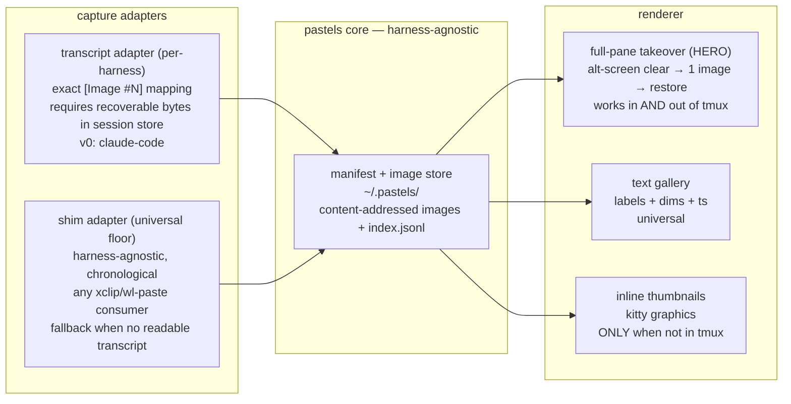

# pastels — prd & build plan

> see what you pasted. image recall for agentic CLI sessions over SSH.

- **status:** phase 0 PASSED ✅ → phase 1 gated (behind whetstone kernel test — see §11)
- **owner:** dave
- **time budget:** ~~1 evening (phase 0)~~ done → 1 weekend (phase 1) → 1 week dogfood (phase 2 gate) → launch
- **hard rule:** does not displace whetstone hours. phase 0 is spent; phase 1 waits until whetstone's kernel test is done.

---

## 1. problem

When pasting images into Claude Code or opencode, the chat shows opaque references like `[Image #1]`, `[Image #4]` — with no way to see the image again.

Claude Code's official answer is Cmd+Click on the `[Image #N]` link to open it in your default viewer. **This breaks over SSH**: the "default viewer" is on the headless remote, and the path doesn't exist on your local machine. The exact population that needed cc-clip (agentic CLI over SSH) hits this wall immediately after solving paste.

Today's workaround: none. You re-paste, or you scroll and guess.

## 2. who it's for

- Primary: developers running Claude Code / opencode on remote machines over SSH (the cc-clip audience)
- Secondary: local users who paste many images per session and lose track ([Image #N] is opaque locally too)

## 3. what it is (one line)

A CLI that recovers every image pasted into an agent session and shows it inline in the terminal, with the exact `[Image #N]` label it has in the conversation.

**Primary interaction (revised after phase 0):** `pastels show N` takes over the screen, paints one image full-size, waits for a keypress, restores. This is the hero command — it works identically inside and outside tmux. The bare `pastels` gallery is a **text list** of labels + dims + timestamps, with inline thumbnails *only* outside tmux (see §5.4 for why).

## 4. non-goals (v0)

- ❌ NOT a clipboard bridge. cc-clip owns transport; pastels is memory. Composes with cc-clip, never competes.
- ❌ No daemon, no background process, no server.
- ❌ No web UI (phase 4, only if terminal rendering proves insufficient).
- ❌ Only ONE capture adapter ships in v0 (Claude Code). Other harnesses are designed-for, not built — see §5.6.
- ❌ No inline scrolling image gallery inside tmux. Phase 0 proved this desyncs; `show N` replaces it.
- ❌ No Windows.
- ❌ No image editing/annotation/OCR. Recall only.

## 5. architecture

Portable core + thin capture adapters (same shape as whetstone). The core never knows where images came from. Two capture *strategies*, one core, one renderer.



### 5.1 capture adapter A: transcript reader (primary, v0 = claude-code)

Claude Code persists session transcripts as JSONL under `~/.claude/projects/<project-slug>/<session-id>.jsonl`.

**Validated in phase 0.1 ✅** — pasted images are stored **inline** as standard content blocks:
```
{ "type": "image",
  "source": { "type": "base64", "media_type": "image/png", "data": "<base64>" } }
```
Three pasted images → three blocks, distinct payloads, all recoverable. ~84% of the transcript file was image bytes, confirming fully inline (no external paths to chase).

- Parse JSONL lazily on invocation (no watcher in v0). Walk for `type=="image"` blocks with `source.data`; collect in document order.
- `N` = order of appearance across the session (1-based). **Assumed, not yet confirmed by reference — verify at build time** by referencing a known image and checking the number lines up (phase 0.2, deferred to phase 1).
- Multiple images in one prompt = one message line with multiple blocks. The walker flattens across this correctly (this is why `grep -c base64` showed `1` while the walker found `3` — line-count artifact, benign).
- Defensive parsing: format is internal and unversioned. Explicit shape guards; on unknown shape, degrade to "found image, label uncertain" rather than crash. Fixture transcript in the repo as a canary test.

### 5.2 capture adapter B: shim (universal floor — built when 2nd harness lands)

A ~40-line wrapper installed earlier in `PATH` than the real `xclip`/`wl-paste` (delegates downward; composes with cc-clip's shim by PATH order):

```
harness reads clipboard
  → ~/.pastels/bin/xclip (ours) → exec real/cc-clip xclip, tee stdout
  → if output is image bytes: write image + append index.jsonl
  → bytes pass through untouched
```

- The **cross-harness baseline**: works for any tool that shells out to `xclip`/`wl-paste`, with or without cc-clip underneath.
- Limitation: timestamps only, **no `[Image #N]` mapping**. This is why the transcript adapter is preferred wherever a readable transcript exists.
- NOT built in v0 — claude-code's transcript adapter is sufficient alone. Built when the first harness without a recoverable transcript needs support.

### 5.3 storage layout

```
~/.pastels/
  images/<sha256-12>.png        # content-addressed, dedupe free
  index.jsonl                   # {ts, hash, bytes, w, h, source, session_id?, image_n?}
```

- PNG dims from the IHDR header (16 bytes) — no imagemagick dependency.
- `pastels gc` prunes images older than N days (default 7). No daemon; gc runs opportunistically on invocation.

### 5.4 renderer — phase 0 findings are load-bearing

Phase 0 tested rendering in dave's real environment (ghostty + tmux over SSH). Results:

| environment | inline kitty graphics | verdict |
|---|---|---|
| ghostty, no tmux | ✅ lands at cursor, scrolls correctly (0.3) | inline OK |
| ghostty + tmux, passthrough on, bare escapes | ❌ silently swallowed | must wrap |
| ghostty + tmux, `\x1bPtmux;` envelope (esc doubled) | ⚠️ renders but **overlays scrollback, wrong position** (0.4) | unusable for gallery |
| ghostty + tmux, full-screen clear + envelope | ✅ clean placement (0.4 confirmed) | **hero path** |

**Why inline fails in tmux:** kitty graphics place the image at the terminal's physical cursor cell, occupying space the grid doesn't track. tmux virtualizes the grid but has no model of the image's row count, so ghostty paints pixels while tmux lays text obliviously → desync/overlay. This is structural, not a wrapping bug.

**Resulting renderer design:**
1. **`pastels show N` — full-pane takeover (HERO).** Enter alternate screen (`\x1b[?1049h`), paint one image, wait for keypress, leave alt-screen (`\x1b[?1049l`) restoring the user's scrollback. Phase 0 validated plain clear (`\x1b[2J\x1b[H`); alt-screen is the production refinement (preserves scrollback) — **validate it holds under tmux in phase 1.** Works in and out of tmux because nothing scrolls.
2. **tmux envelope is mandatory for ANY inline graphics.** When `$TMUX` is set, wrap every kitty sequence: `\x1bPtmux;` + (sequence with every `\x1b` doubled) + `\x1b\\`. Confirmed required in 0.4.
3. **`pastels` (bare) — text gallery.** Labels + dims + timestamps always. Inline thumbnails appended **only when `$TMUX` is unset** (where inline is clean). In tmux: text only + one-line hint to use `show N`.
4. **Capability detection up front.** Detect tmux (`$TMUX`), check/set `allow-passthrough`, detect terminal graphics support. Never emit raw escapes at a terminal that can't render them — fall back to the text table.

### 5.5 cli surface (v0 — keep it this small)

```
pastels                  # text gallery: [Image #N] + dims + ts (+ inline thumbs only outside tmux)
pastels show N           # HERO: full-pane render of image #N (alt-screen, works everywhere)
pastels -s               # pick a session, then gallery
pastels path N           # print file path (re-feed to agent, or recover a paste you didn't save)
pastels gc [--days 7]    # prune
```

Five commands. Anything else waits for a user to ask.

### 5.6 multi-harness strategy (designed-for, not built)

The `CaptureAdapter` interface is the extension point:
```
interface CaptureAdapter {
  name: string
  detect(): boolean                       // harness present? session available?
  listSessions(): Session[]
  extractImages(session): CapturedImage[]  // {n, bytes, mediaType, ts}
}
```
Core + renderer are fully harness-agnostic. Adding a harness = implement the interface; no rearchitecture.

**But each harness earns its slot with its own mini kernel test** (a 0.1-equivalent): *does this harness store recoverable image bytes with a stable per-message index?*
- **claude-code** → yes (validated). transcript adapter, exact labels. v0.
- **opencode / codex / pi** → unknown, validate per-harness. codex reads the clipboard via arboard/X11 and may not persist a readable transcript at all → likely shim-only (chronological, fuzzy labels).
- **honesty:** exact `[Image #N]` is a claude-code property. Other harnesses get exact labels only if their store supports it; otherwise the shim floor (weaker). Don't promise uniform quality across harnesses.

## 6. stack

- **TypeScript, single npm package, `pastels` bin** (name confirmed available on npm). Every Claude Code user has Node → `npm i -g pastels` is zero-friction for exactly this audience. Plays to dave's strengths.
- Zero runtime deps if possible; tiny ones (kitty-protocol encoder) acceptable. No framework.
- Shim (when built) is plain bash — hot path, must not cost a Node startup per clipboard read.
- Repo: MIT, conventional commits, single package. CI: typecheck + unit tests + transcript-fixture canary on PR.

## 7. phases & gates

### phase 0 — kernel test ✅ PASSED

- [x] 0.1 images recoverable as inline base64 in claude-code JSONL — **yes**, standard `{type:image, source:{base64,media_type,data}}`
- [ ] 0.2 `[Image #N]` ordering matches block order — **deferred to phase 1** (build-time verification by reference; not a blocker)
- [x] 0.3 render PNG inline in ghostty over SSH via kitty graphics — **yes** (bare ghostty)
- [x] 0.4 tmux behavior — **resolved**: needs `\x1bPtmux;` envelope + passthrough; inline overlays scrollback; **full-pane clear renders cleanly** → drove the renderer redesign in §5.4
- [x] 0.5 shim contingency — **not needed** for claude-code; reclassified as the universal cross-harness floor (§5.2)

**Verdict:** transcript recovery + full-pane rendering both work end-to-end in dave's real environment. Architecture locked. Build is a believable weekend.

### phase 1 — v0 build (1 weekend) — GATED behind whetstone kernel test

- [ ] `CaptureAdapter` interface + claude-code transcript adapter + fixture canary test
- [ ] verify 0.2: confirm N = appearance order by referencing a known image
- [ ] manifest + content-addressed store + gc
- [ ] renderer: alt-screen full-pane `show N` (validate alt-screen under tmux) + tmux envelope + capability detection + text gallery
- [ ] the 5 commands
- [ ] README: problem gif at top, install, 3 usage lines, "works great with cc-clip" section
- [ ] npm publish `pastels` (claim at 0.0.1)

### phase 2 — dogfood (1 week, HARD GATE)

- [ ] daily use on real airfairness/redspace work
- [ ] **kill signal: if dave doesn't invoke it organically by day 3, the pain wasn't real → archive, mark killed, no launch**
- [ ] fix only what dogfooding surfaces; resist feature ideas

### phase 3 — launch (only after phase 2 passes)

- [ ] 60–90s screencast gif: paste 4 screenshots → "[Image #2]" → `pastels show 2` → there it is
- [ ] blog post: "you can't see what you pasted" — problem-first, ~800 words, ends with the cc-clip + pastels remote workflow
- [ ] X thread: gif + 4–5 posts
- [ ] cross-post in cc-clip discussions (complementary; their README already links ecosystem issues)
- [ ] reply with the tool in existing claude-code GitHub issues about image visibility over SSH
- [ ] ghostty showcase (kitty-graphics tools are on-brand)

### phase 4 — only if pulled by users

per-harness adapters (opencode → codex → pi, each validated separately) · shim adapter build · web gallery on tailnet · iterm2 renderer (OSC 1337) · `pastels watch` live mode

## 8. risks

| risk | likelihood | mitigation |
|---|---|---|
| anthropic ships native image recall | high, eventually | feature, not moat. value = reputation + own itch. ship cheap; if upstreamed, pastels had its moment |
| alt-screen graphics misbehave under tmux | medium | validate in phase 1 before committing; fall back to plain clear (proven in 0.4) if needed |
| multi-harness quality variance (exact-N only on claude-code) | medium | set expectations honestly; shim floor for the rest; validate each before promising |
| transcript format changes silently | medium | defensive parsing, fixture canary, degrade-don't-crash |
| scope creep (clipboard manager / all-harnesses-at-once) | medium-high | §4 non-goals + §5.6 "validate per harness" are the contract |
| eats whetstone hours | **the real one** | phase 1 gated behind whetstone kernel test. budgets are ceilings |

## 9. open questions

1. ~~exact JSONL shape~~ — answered (§5.1)
2. does alt-screen + kitty graphics place cleanly under tmux, or stick with plain clear? (phase 1)
3. is N reliably appearance-order? (phase 1, 0.2)
4. per-harness: which of opencode/codex/pi expose recoverable image bytes? (phase 4, each its own test)

## 10. launch thesis (calibrated)

cc-clip proves the niche exists (~100 stars in months, active issues across claude-code/codex/opencode). pastels rides the same wave with a complementary story, easier than a competing one. realistic outcome: tens-to-low-hundreds of stars, a good blog post, talk fuel, and a visible artifact in the harness ecosystem where whetstone will later launch — audience overlap is the compounding play. small project, doesn't need to be big.

## 11. sequencing discipline

Phase 0 is spent (one evening, as budgeted). **Phase 1 does not start until whetstone's kernel test is done.** pastels passing its gate does not let it jump the queue — that's the "competes for the same hours" trap the gates exist to prevent. whetstone is the priority OSS bet; pastels is the cheap, fast, audience-adjacent warm-up.
